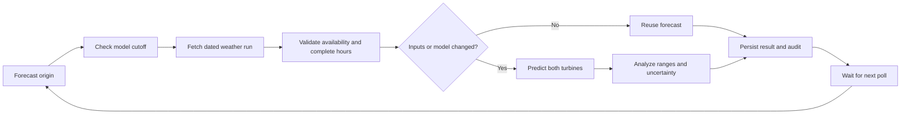

# No Shutdown wind forecasting agent

A working live dashboard and autonomous forecasting backend for the HackAlem wind power case. It fetches the latest Open-Meteo ECMWF IFS weather forecasts at both turbine coordinates, runs trained turbine models, applies the team's physics checks, and reports the next 24 or 48 hourly power values in **MW** and energy in **MWh**. The user supplied **2.5 MW per turbine (5 MW total)**; this is editable in `config/turbines.json`.

The dashboard uses the live backend and refreshes every five minutes. The server also polls weather in the background while it is running. Weather acquisition failures are shown explicitly. Current weather is a **model estimate**, and generation is a forecast, not measured turbine telemetry. [Live forecasting details](docs/LIVE.md).

**Delivery mode: GitHub repository only; deployment is deferred to the team.** No site or background forecasting service is left running on the user's PC. [Deployment handoff](docs/DEPLOYMENT.md). The commands below are optional development instructions.

The supplied datasets contain **291,859 ten-minute observations ending on January 31, 2026**. They contain **no February ground truth**, despite the filenames. February forecasts can be produced, but February accuracy cannot be scored from these files. The model validation report explicitly measures conditional weather-to-power error using observed weather, not operational day-ahead accuracy.

## Run on Windows

Open PowerShell in this project directory. `start.ps1` uses Python 3.12+ or the installed Codex Python runtime, creates a local virtual environment and installs the pinned dependencies.

```powershell
powershell -ExecutionPolicy Bypass -File .\start.ps1
```

Open http://127.0.0.1:8000/ for the live dashboard, or http://127.0.0.1:8000/docs for the interactive API. Keep the server running and the PC awake for updates. All data, model artifacts and state default to the project directory. Set `WINDAGENT_HOME` or use `python -m windagent --home PATH ...` to choose another complete data directory. The server binds to localhost by default.

For a conventional Python installation on any supported OS:

```sh
python -m venv .venv
# Windows: .venv\Scripts\activate
# Linux/macOS: source .venv/bin/activate
python -m pip install -r requirements.lock.txt
python -m windagent train
python -m windagent serve
```

Fetch and save a current forecast without the dashboard:

```sh
python -m windagent live --horizon 48 --refresh
# Writes reports/live_forecast.json and reports/live_forecast.csv.
python -m windagent watch --interval 300
```

## Reproduce the historical scenario

```sh
python -m windagent train --cutoff 2026-02-01T00:00:00+05:00
python -m windagent forecast --origin 2026-02-01T00:00:00+05:00 --horizon 48 --output reports/first_forecast.json --csv reports/first_forecast.csv
python -m windagent replay --start 2026-02-01T00:00:00+05:00 --days 28
python -m windagent backtest --start 2026-01-01T00:00:00+05:00 --days 7
python -m pytest -q
```

The first origin is the end of January 31 in site local time. To forecast from the *start* of January 31, train a separate model with `--cutoff 2026-01-31T00:00:00+05:00` in a separate `--artifact-dir`; never use a model trained on the rest of that day. Full February replay creates overlapping 48-hour forecasts each day. The last origin extends into March 1; evaluation must restrict targets to the requested February window and compare lead times separately.

```sh
# Refresh one historical origin. Unchanged content reuses the previous predictions.
python -m windagent forecast --origin 2026-02-01T00:00:00+05:00 --refresh
# Autonomous polling of the live weather API.
python -m windagent watch --interval 300
# Or watch a fixed historical origin for revised provider input.
python -m windagent watch --origin 2026-02-01T00:00:00+05:00 --interval 300
```

## How it works



The agent is an autonomous **policy-driven ML system**. It chooses reuse, recomputation or failure based on validated evidence. Its actions are auditable and it requires no language-model API key. It does not claim to use an LLM.

Telemetry is interpreted as local `Asia/Almaty` time and converted to UTC. An hourly mean requires at least four valid distinct ten-minute samples. Missing hours are not filled with future observations. A row represents the start of its interval and becomes available at its end. The timezone and interval convention are explicit assumptions because the supplied CSV does not specify them.

Two model families compete on a chronological validation period: a learned wind-speed curve and gradient-boosted trees. An untouched later period measures the selected model; all production fitting respects the declared cutoff. Source hashes, feature schema, split boundaries and model artifact hashes accompany the trained models. Prediction intervals describe historical conditional residuals and do **not** incorporate full weather forecast uncertainty.

Weather comes from [Open-Meteo Single Runs](https://open-meteo.com/en/docs/single-runs-api), with explicit ECMWF initialization time. The provider documents IFS HRES 9km single runs from March 2024. We assume a conservative 12-hour publication delay and require initialization plus that delay to be no later than the forecast origin. This models availability; it is not proof of the provider's exact historical publication time. Raw cached responses preserve source provenance and support offline replay. [Weather details](docs/WEATHER.md).

## Outputs and evidence

The delivered February replay completed **28/28 origins**, producing **2,688 turbine forecast rows**. A separate model frozen before January was tested on seven January origins using archived forecast weather, with all 672 rows matched to actuals:

| Turbine | Lead hours | Model MAE | Persistence MAE |
|---|---|---:|---:|
| 1 | 0–23 | 0.1398 | 0.2850 |
| 1 | 24–47 | 0.1355 | 0.2292 |
| 2 | 0–23 | 0.1389 | 0.2994 |
| 2 | 24–47 | 0.1333 | 0.2144 |

All errors use normalized power units. This is a small diagnostic with overlapping origins, not a February or seasonal score. Exact metrics, run provenance and observation coverage are in `reports/january_backtest.json`; individual predictions and the baseline are in `reports/january_backtest_predictions.csv`. The uncalibrated forecast-to-site wind mismatch remains an accuracy limitation. No tuning was performed on this diagnostic.

- `artifacts/`: trained turbine models and metadata.
- `reports/`: dataset profile, validation evidence, replay outcomes and hourly exports.
- `data/raw/`: original supplied CSVs under stable names.
- `data/weather/`: successful archived weather responses and provenance.
- `state/`: local SQLite run history and audit events, excluded from git.
- `docs/`: original brief, implementation plan, requirements and limitations.

Useful API routes: `GET /health`, `GET /model`, `POST /forecasts`, `GET /forecasts`, `GET /forecasts/{id}`, `GET /forecasts/{id}/csv` and `POST /replay`. A forecast POST body is `{"origin":"2026-02-01T00:00:00+05:00","horizon":48,"refresh":false}`. The detail response includes the audit trail. `/docs` supplies an interactive form for every endpoint.

The live dashboard uses `GET /api/live?hours=48&refresh=false` and `GET /api/live/status`. Its payload includes weather retrieval and forecast issue times, model training age, source hashes, physics corrections, per-turbine MW and farm MWh. `refresh=true` forces a weather request. The older `GET /api/forecast?turbine_id=T1&as_of_date=2026-02-01&horizon_hours=48` remains a historical compatibility route, with normalized `predicted_power` and UTC points; it is not the live dashboard feed.

Historical replay reports retain their original normalized units and equal-weight farm proxy. Live forecasts convert each normalized prediction to MW using the user-supplied 2.5 MW capacity; hourly MWh is MW multiplied by one hour. Farm power and energy are sums of both turbines. Do not compare these units without conversion.

## Limits that affect the result

1. No February observations were supplied. Do not quote February MAE/RMSE until actuals are obtained.
2. The weather grid wind height is assumed; actual hub height and SCADA measurement height need confirmation. Grid-to-site bias calibration using pretest archived weather is an important next step.
3. Publication latency is a conservative configured assumption. Verify it against the organizer's required forecast issuance schedule.
4. Plant curtailment and outages are absent. The models cannot separately identify those causes. Nameplate capacities were supplied by the user after the original prototype.
5. Retraining is explicit. Automatic weather updates recalculate predictions; they do not silently retrain a historical model using later labels.

Only load trusted local model artifacts. The API is intended for local hackathon use; add authentication, TLS and request budgets before external deployment. A `Dockerfile` is provided for packaging; a live deployment is not required for the local workflow.

## Development references

[Requirements and acceptance criteria](docs/REQUIREMENTS.md), [implementation plan](docs/IMPLEMENTATION_PLAN.md), [scikit-learn histogram gradient boosting](https://scikit-learn.org/stable/modules/generated/sklearn.ensemble.HistGradientBoostingRegressor.html), [FastAPI server deployment](https://fastapi.tiangolo.com/deployment/manually/).
